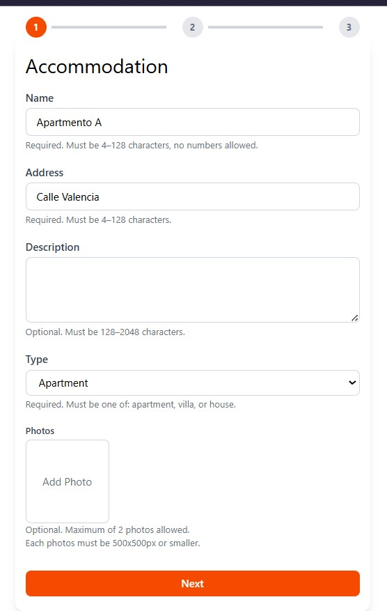
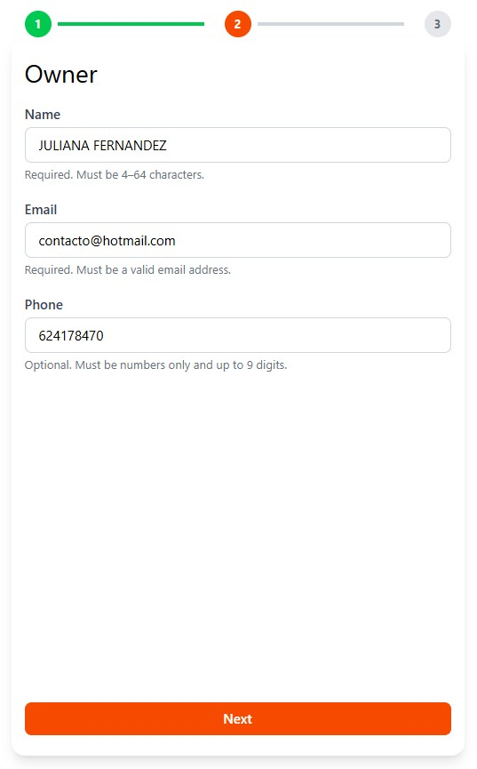
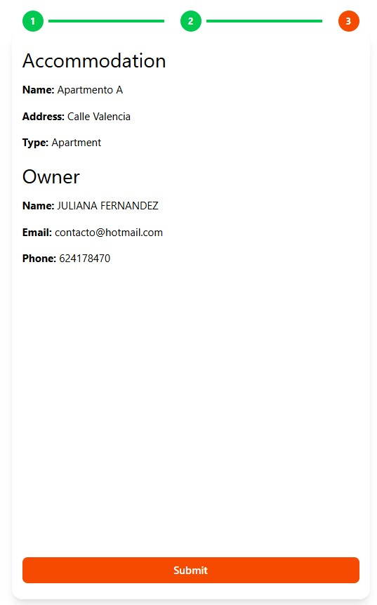
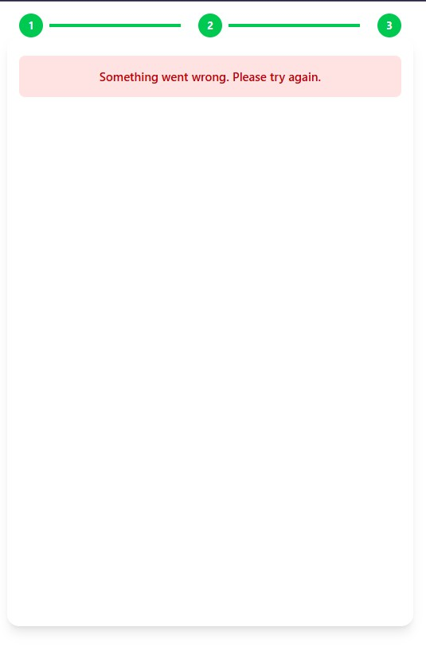

# Multi-Step Accommodation Form (Web Component)

### [Access Live Demo](https://multi-step-accommodation-form.netlify.app/)

---

## 📋 Index

- [About](#-about)
- [Preview](#-preview)
- [Tech Stack](#-tech-stack)
- [How to Run Locally](#-how-to-run-locally)
- [Why No External Libraries?](#-why-no-external-libraries)
- [Feedback Simulation](#-feedback-simulation)

---

## 🔖 About

This project is a **multi-step accommodation form**, built as a **self-contained web component** using React and TypeScript.  
It handles user input in three steps — Accommodation, Owner, and Summary — with validation at each stage and a random success/failure feedback simulation after submission.

The component is exported as a **Custom Element**, allowing it to be embedded in any HTML page with minimal configuration.

---

## 🖼 Preview

<p align="center">
  
  
  
  
</p>

---

## 🚀 Tech Stack

- **React** (with functional components & hooks)
- **TypeScript**
- **TailwindCSS** (utility-first styling)
- **Vite** (build tool)
- **Custom Elements / Web Components API**

---

## 🗂 How to Run Locally

```bash
# Clone the repository
git clone https://github.com/JuFML/multi-step-form-webcomponent.git

# Navigate into the project folder
cd multi-step-form-webcomponent

# Install dependencies
npm install

# Run the project in development mode
npm run dev

# Build for production
npm run build
```

After building, open dist/custom-form-result.html in your browser to test the embedded component.

---

## 🧠 Why No External Libraries?

To better showcase technical skills, no libraries like React Hook Form, Zod, Yup, or Redux were used.

# This ensures:
- Full control of logic and state
- Lightweight bundle
- Clarity in how validation and transitions are handled
- This also aligns with the requirement to keep the component modular, embeddable, and self-contained.

---

## 📩 Feedback Simulation

After submission, the form displays a simulated feedback message — success or fail — and automatically resets the form after a short delay, demonstrating realistic user flow and usability.

---

Developed ❤ by Juliana Fernandez


